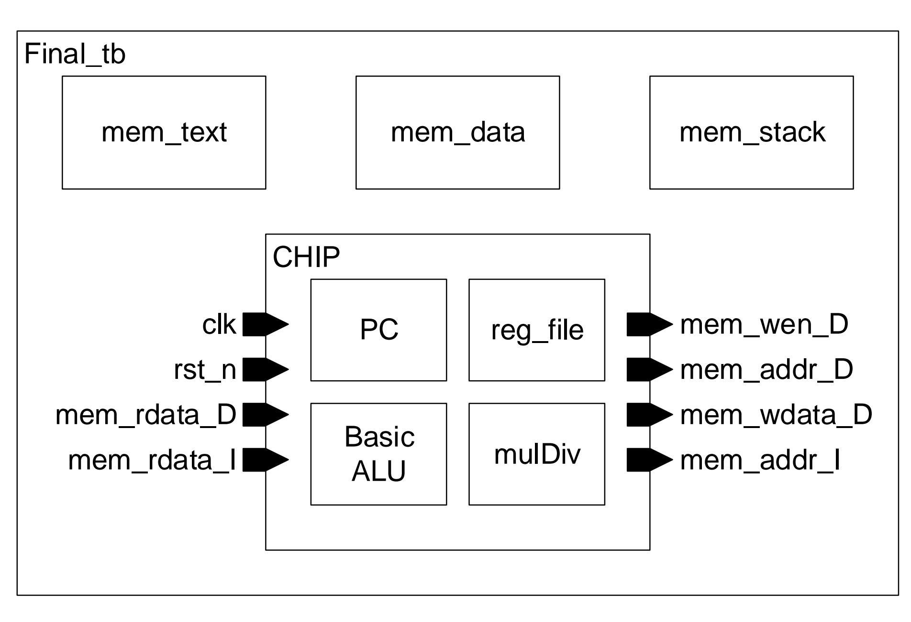
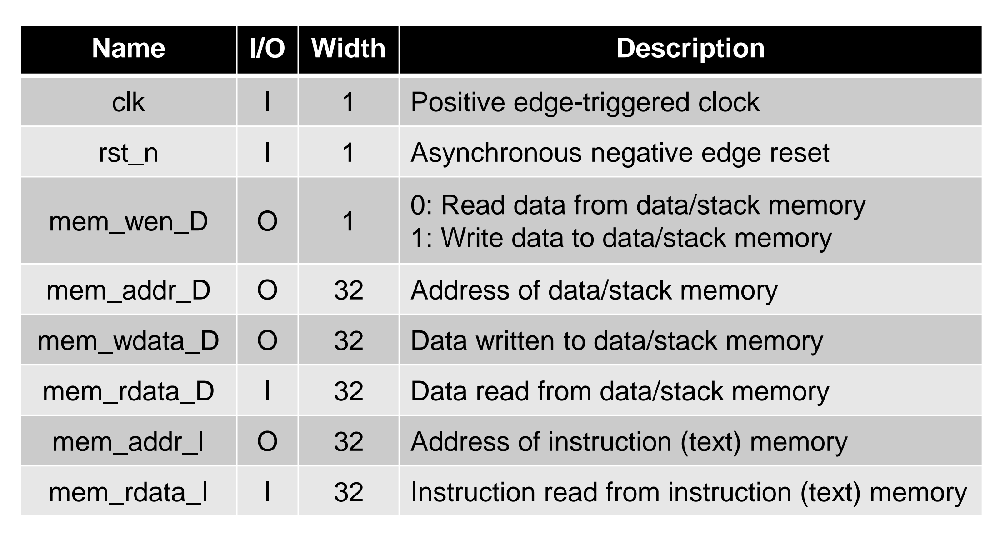
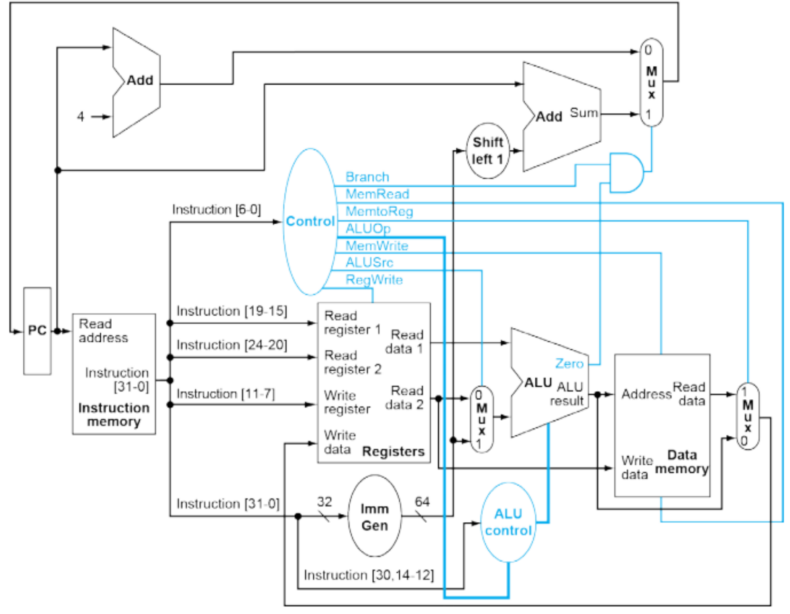
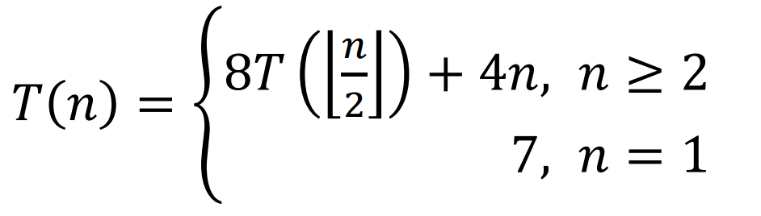

# Register-transfer Level Programming: A Single-cycle CPU

## Overview

This project includes assembly and Verilog implementations of a single-cycle CPU capable of performing various arithmetic operations, including factorial calculations and recursive function calls. The project is organized into two main directories: `Assembly` and `Verilog`.


### Project Highlights
 - Designed and implemented a fully functional single-cycle CPU supporting basic arithmetic operations, including multiplication and division.
  - Enabled multi-cycle operations for handling complex computations.
  - Supported advanced mathematical operations such as recursive function calls.

### High-level Specification


### Port Definitions


### CUP Architecture

(Figure sourced from Chapter 4, "The Processor," in *Computer Organization and Design RISC-V Edition* by David A. Patterson and John L. Hennessy.)

### Supported Instructions
 - Basic: `auipc`, `jal`, `jalr`, `beq`, `lw`, `sw`, `addi`, `slti`, `add`, `sub`.
 - Advanced: `mul`, `srai`, `slli`.

 For additional details on other instructions and their corresponding machine codes, please refer to [RISC-V_Instruction_Set_List.pdf](./RISC-V_Instruction_Set_List.pdf)


### Multi-Cycle Operation Implementation Details
 - When the CPU decodes a `mul` instruction, it issues a `valid` signal to the `mulDiv` module.
 - Once the CPU receives a `ready` signal, the lower 32-bit result is stored in `rd`.


### Assembly Directory

- `Assembly/fact.s`: Assembly code for calculating the factorial of a number.
- `Assembly/hw1.s`: Assembly code for an assignment.
- `Assembly/leaf.s`: Assembly code for the leaf function.


### Verilog Directory

- `Verilog/CHIP.v`: Verilog code for the main chip module.
- `Verilog/Final_tb.v`: Testbench for the implemented CPU.
- `Verilog/memory.v`: Verilog code for the memory module.
- `Verilog/license.cshrc`: License configuration file.

#### Fact Directory

- `Verilog/fact/fact_data_ans.txt`: Expected output data for the factorial calculation.
- `Verilog/fact/fact_data.txt`: Input data for the factorial calculation.
- `Verilog/fact/fact_gen.py`: Python script to generate input and expected output data for the factorial calculation.
- `Verilog/fact/fact_text.txt`: Assembly instructions for the factorial calculation.

#### HW1 Directory

- `Verilog/hw1/hw1_data_ans.txt`: Expected output data for the assignment.
- `Verilog/hw1/hw1_data.txt`: Input data for the assignment.
- `Verilog/hw1/hw1_gen.py`: Python script to generate input and expected output data for the assignment.
- `Verilog/hw1/hw1_text.txt`: Assembly instructions for the assignment.

#### Leaf Directory

- `Verilog/leaf/leaf_data_ans.txt`: Expected output data for the leaf function.
- `Verilog/leaf/leaf_data.txt`: Input data for the leaf function.
- `Verilog/leaf/leaf_gen.py`: Python script to generate input and expected output data for the leaf function.
- `Verilog/leaf/leaf_text.txt`: Assembly instructions for the leaf function.

## How to Run (CPU Testbench)
Below are the instructions for running several test cases to verify the CPU's functionality.

### Test 1: Leaf Function
```sh
cd Verilog
ncverilog Final_tb.v +define+leaf +access+r
```
This loads variables `a`, `b`, `c`, and `d` from memory addresses `0x00010064` to `0x00010070`, and stores the result at `0x00010074`.

### Test 2: Factorial Calculation
```sh
cd Verilog
ncverilog Final_tb.v +define+fact +access+r
```
This loads `n` from memory address `0x0001006c` and stores the result at `0x00010070`.

### Test 3: Recursive Computation
```sh
cd Verilog/hw1
python hw1_gen.py  # Generate test patterns

cd ../
ncverilog Final_tb.v +define+hw1 +access+r
```
This executes a recursive function using the CPU. The recursive function is defined as follows:



### Generating Test Patterns with Python
To generate input and expected output data for testing, run the following scripts:

```sh
python Verilog/fact/fact_gen.py
python Verilog/hw1/hw1_gen.py
python Verilog/leaf/leaf_gen.py
```

## License
This project follows the licensing configurations specified in `Verilog/license.cshrc`.

## Contact
For inquiries or issues, please reach out to the project maintainer.